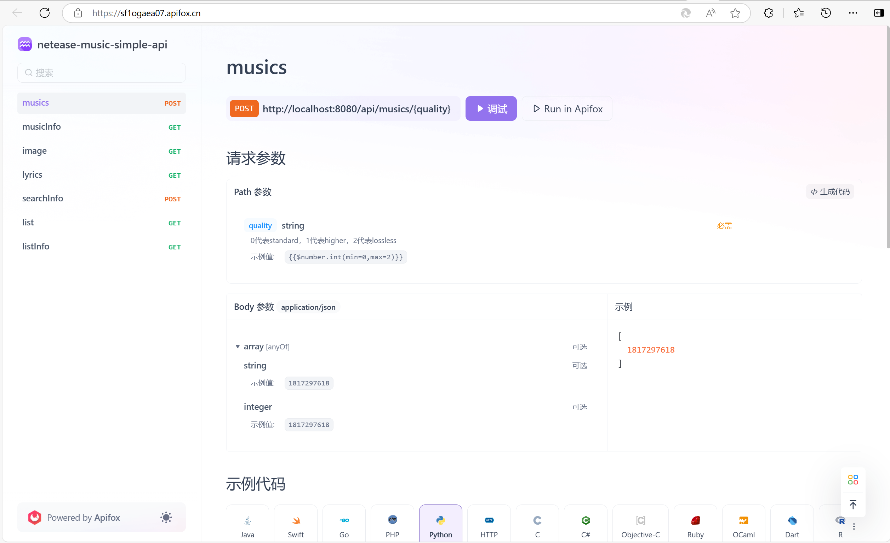

# Netease Music 简单API
## 声明
```text
1. 本项目仅供学习交流使用，若解析失效，不做维护。
2. 解析需要自行手动设置Cookie，如果没有会员，将无法解析会员歌曲。
3. 本项目只做解析，不会传输或存储任何音乐数据，目的仅供个人方便使用。
```

## 功能介绍
```text
  解析使用spring-boot-autoconfigure项目结构，服务端使用Spring Boot自动配置解析项目。解析项目提供了软件包的简单api，而服务端项目提供了网络层面的简单api。可根据实际需要选择项目。
```
#### 解析项目：
```text
解析项目提供了以下Spring Bean，每个Spring Bean存在run方法，解析时调用相应run方法即可。
```
| 名称 | 参数 | 返回值 |
| :----- | :----- | :----------- |
| GetMusics | List<String>(music id list), Integer(quality) | List<String>(url list) |
| GetImage | String(music id) | String(url) |
| GetLyrics | String(music id) | List<String>(lyric, trans lyric) |
| GetSearchInfo | String(content), Integer(page), Integer(size) | JSONArray(musics) |
| GetMusicList | String(list id) | JSONArray(musics) |
| GetMusicInfo | String(music id) | JSONObject(info) |
| GetListInfo | String(list id) | JSONObject(info) |
#### 服务端：
```text
服务端提供了默认端口8080，/api路径下的一系列api
```
点击查看[Apifox文档](sf1ogaea07.apifox.cn)



